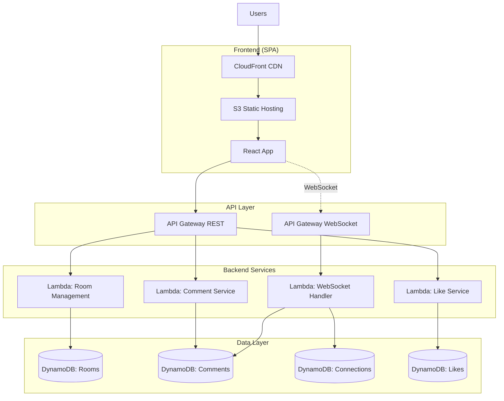
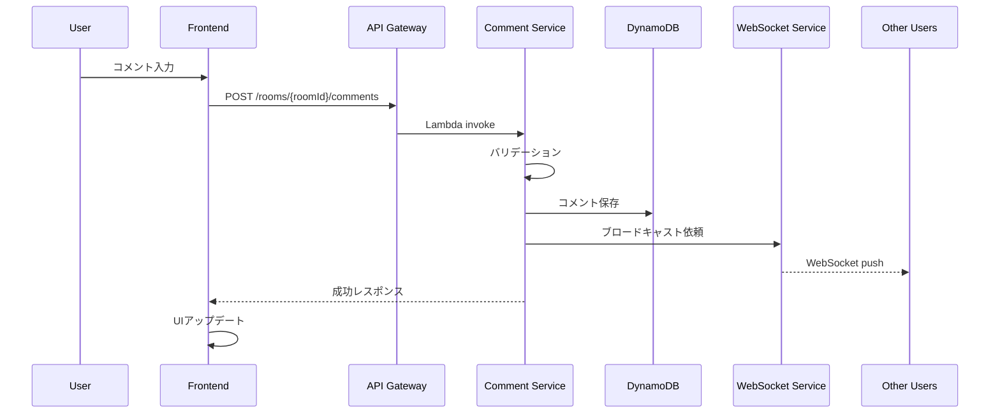

# 詳細設計書 - リアルタイムコメント投稿アプリケーション「Commentia」

## 1. アーキテクチャ概要

### 1.1 システム構成図



### 1.2 技術スタック

- **言語**: TypeScript 5.7+
- **フロントエンド**:
  - React 18.3
  - Vite 5.x (ビルドツール)
  - TanStack Query (データフェッチング)
  - Zustand (状態管理)
  - React Router v6 (ルーティング)
  - Tailwind CSS (スタイリング)
- **バックエンド**:
  - AWS Lambda (Node.js 22.x runtime)
  - esbuild (バンドル)
  - aws-sdk v3
- **インフラ**:
  - AWS CDK v2
  - AWS Services: S3, CloudFront, API Gateway, Lambda, DynamoDB
- **開発ツール**:
  - npm workspaces (モノレポ管理)
  - Jest (テスト)
  - Biome (フォーマッター/リンター)
  - LocalStack (ローカル開発)

## 2. コンポーネント設計

### 2.1 コンポーネント一覧

| コンポーネント名 | 責務 | 依存関係 |
|-----------------|------|----------|
| Frontend App | ユーザーインターフェース提供 | API Gateway, WebSocket |
| Room Service | ルーム作成・管理 | DynamoDB (Rooms) |
| Comment Service | コメント投稿・取得 | DynamoDB (Comments), WebSocket Service |
| WebSocket Service | リアルタイム通信管理 | DynamoDB (Connections, Comments) |
| Like Service | いいね機能管理 | DynamoDB (Likes), WebSocket Service |
| QR Service | QRコード生成 | - |

### 2.2 各コンポーネントの詳細

#### Frontend App

- **目的**: SPAとしてユーザーインターフェースを提供
- **主要モジュール**:
  ```typescript
  // ディレクトリ構造
  packages/frontend/
  ├── src/
  │   ├── components/       # UIコンポーネント
  │   │   ├── room/        # ルーム関連
  │   │   ├── comment/     # コメント関連
  │   │   └── common/      # 共通コンポーネント
  │   ├── hooks/           # カスタムフック
  │   ├── stores/          # Zustand stores
  │   ├── services/        # API通信層
  │   ├── utils/           # ユーティリティ
  │   └── types/           # 型定義
  ```

#### Room Service (Lambda)

- **目的**: ルームのCRUD操作
- **公開インターフェース**:
  ```typescript
  interface RoomService {
    createRoom(hostId: string): Promise<Room>;
    getRoom(roomId: string): Promise<Room | null>;
    closeRoom(roomId: string, hostId: string): Promise<void>;
    generateRoomCode(): string;
  }

  interface Room {
    roomId: string;
    roomCode: string;  // 6桁の短縮コード
    hostId: string;
    createdAt: string;
    status: 'active' | 'closed';
    settings: RoomSettings;
  }

  interface RoomSettings {
    maxCommentsPerUser: number;
    maxLikesPerUser: number;
    commentMaxLength: number;
  }
  ```

#### Comment Service (Lambda)

- **目的**: コメントの投稿・取得・削除
- **公開インターフェース**:
  ```typescript
  interface CommentService {
    postComment(params: PostCommentParams): Promise<Comment>;
    getComments(roomId: string, sortBy: 'latest' | 'likes'): Promise<Comment[]>;
    deleteComment(commentId: string, userId: string): Promise<void>;
  }

  interface Comment {
    commentId: string;
    roomId: string;
    userId: string;
    userName: string;
    content: string;
    timestamp: string;
    likeCount: number;
  }
  ```

#### WebSocket Service

- **目的**: リアルタイム通信の管理
- **公開インターフェース**:
  ```typescript
  interface WebSocketService {
    handleConnect(connectionId: string): Promise<void>;
    handleDisconnect(connectionId: string): Promise<void>;
    joinRoom(connectionId: string, roomId: string, userName: string): Promise<void>;
    broadcast(roomId: string, message: WSMessage): Promise<void>;
  }

  type WSMessage =
    | { type: 'comment_new'; data: Comment }
    | { type: 'comment_deleted'; data: { commentId: string } }
    | { type: 'like_updated'; data: { commentId: string; likeCount: number } }
    | { type: 'user_joined'; data: { userName: string; userCount: number } }
    | { type: 'user_left'; data: { userName: string; userCount: number } };
  ```

## 3. データフロー

### 3.1 コメント投稿フロー



### 3.2 データ変換

- **入力データ形式**:
  - ユーザー入力: プレーンテキスト (最大500文字)
  - APIリクエスト: JSON形式
- **処理過程**:
  - XSSサニタイゼーション
  - 文字数バリデーション
  - 連続投稿チェック
  - DynamoDB形式への変換
- **出力データ形式**:
  - APIレスポンス: JSON形式
  - WebSocket: JSON形式のメッセージ

## 4. データベース設計

### 4.1 DynamoDBテーブル設計

#### Rooms Table
```typescript
{
  PK: "ROOM#${roomId}",           // パーティションキー
  SK: "METADATA",                  // ソートキー
  roomId: string,
  roomCode: string,                // 6桁コード
  hostId: string,
  createdAt: string,              // ISO 8601
  status: 'active' | 'closed',
  settings: {
    maxCommentsPerUser: number,
    maxLikesPerUser: number,
    commentMaxLength: number
  },
  ttl: number                     // 24時間後に自動削除
}
```

#### Comments Table
```typescript
{
  PK: "ROOM#${roomId}",           // パーティションキー
  SK: "COMMENT#${timestamp}#${commentId}", // ソートキー
  commentId: string,
  userId: string,
  userName: string,
  content: string,
  timestamp: string,
  likeCount: number,
  ttl: number                     // 24時間後に自動削除
}

// GSI: LikeCountIndex
{
  GSI1PK: "ROOM#${roomId}",
  GSI1SK: "LIKES#${likeCount.padStart(10, '0')}#${commentId}"
}
```

#### Connections Table
```typescript
{
  PK: "CONN#${connectionId}",     // パーティションキー
  SK: "METADATA",
  connectionId: string,
  roomId: string,
  userId: string,
  userName: string,
  connectedAt: string,
  ttl: number                     // 接続から2時間後に削除
}

// GSI: RoomConnectionsIndex
{
  GSI1PK: "ROOM#${roomId}",
  GSI1SK: "CONN#${connectionId}"
}
```

#### Likes Table
```typescript
{
  PK: "LIKE#${commentId}",        // パーティションキー
  SK: "USER#${userId}",           // ソートキー
  likedAt: string,
  ttl: number                     // 24時間後に自動削除
}

// GSI: UserLikesIndex
{
  GSI1PK: "USER#${userId}#ROOM#${roomId}",
  GSI1SK: "LIKE#${likedAt}"
}
```

## 5. APIインターフェース

### 5.1 REST API エンドポイント

```yaml
# Room Management
POST   /rooms                    # ルーム作成
GET    /rooms/{roomId}           # ルーム情報取得
DELETE /rooms/{roomId}           # ルーム終了
GET    /rooms/code/{roomCode}    # ルームコードで検索

# Comment Management
POST   /rooms/{roomId}/comments  # コメント投稿
GET    /rooms/{roomId}/comments  # コメント一覧取得
DELETE /comments/{commentId}     # コメント削除

# Like Management
POST   /comments/{commentId}/likes    # いいね追加
DELETE /comments/{commentId}/likes    # いいね取消

# QR Code
GET    /rooms/{roomId}/qr        # QRコード取得
```

### 5.2 WebSocket API

```yaml
# Connection
$connect    # WebSocket接続確立
$disconnect # WebSocket切断

# Custom Routes
joinRoom    # ルーム参加
leaveRoom   # ルーム退出
```

## 6. エラーハンドリング

### 6.1 エラー分類

- **400 Bad Request**: バリデーションエラー
  - 対処: エラーメッセージをユーザーに表示
- **401 Unauthorized**: 権限エラー
  - 対処: ホスト権限が必要な操作を制限
- **404 Not Found**: リソース不在
  - 対処: ルーム不在等の適切なメッセージ表示
- **429 Too Many Requests**: レート制限
  - 対処: 再試行間隔を延長してリトライ
- **500 Internal Server Error**: サーバーエラー
  - 対処: エラーログ記録、ユーザーには一般的なエラーメッセージ

### 6.2 エラー通知

- CloudWatch Logsへのエラーログ出力
- CloudWatch Alarmsでの異常検知
- エラー発生時のメトリクス記録

## 7. セキュリティ設計

### 7.1 入力値検証

- XSS対策: DOMPurifyによるサニタイゼーション
- SQLインジェクション対策: パラメータ化クエリ（DynamoDB SDK使用）
- 文字数制限の厳格な適用

### 7.2 レート制限

- API Gateway段階でのスロットリング設定
- Lambda内での追加チェック（ユーザー単位）
- DDoS対策: CloudFrontでの制限

### 7.3 データ保護

- HTTPS通信の強制
- セッション情報のメモリ管理（認証なし設計）
- 個人情報を保持しない設計

## 8. パフォーマンス最適化

### 8.1 想定される負荷

- 同時接続数: ～100人/ルーム
- コメント投稿頻度: 最大10件/秒/ルーム
- いいね頻度: 最大50回/秒/ルーム

### 8.2 最適化方針

- **フロントエンド**:
  - React.memoによる不要な再レンダリング防止
  - 仮想スクロールの実装（大量コメント対応）
  - 画像の遅延読み込み
  - バンドルサイズ最適化（code splitting）

- **バックエンド**:
  - Lambda同時実行数の設定
  - DynamoDB読み取り/書き込みキャパシティの自動スケーリング
  - 接続プーリングの最適化
  - バッチ処理による効率化

- **インフラ**:
  - CloudFrontキャッシング戦略
  - Lambda Provisioned Concurrencyの検討
  - DynamoDB Accelerator (DAX)の導入検討

## 9. デプロイメント

### 9.1 デプロイ構成

```typescript
// CDKスタック構成
packages/infrastructure/
├── lib/
│   ├── stacks/
│   │   ├── frontend-stack.ts      # S3 + CloudFront
│   │   ├── api-stack.ts           # API Gateway + Lambda
│   │   ├── database-stack.ts      # DynamoDB
│   │   └── websocket-stack.ts     # WebSocket API
│   └── constructs/
│       ├── lambda-function.ts     # Lambda共通設定
│       └── dynamodb-table.ts      # DynamoDB共通設定
```

### 9.2 環境設定

```typescript
// 環境変数管理
interface EnvironmentConfig {
  STAGE: 'dev' | 'staging' | 'prod';
  REGION: string;
  DYNAMODB_ENDPOINT?: string;  // LocalStack用
  WEBSOCKET_ENDPOINT: string;
  API_ENDPOINT: string;
  FRONTEND_URL: string;
}
```

## 10. 実装上の注意事項

- **TypeScript厳格モード**: `strict: true`を維持
- **エラーバウンダリ**: Reactコンポーネントで適切に実装
- **非同期処理**: Promise.allSettledで部分的失敗を許容
- **タイムアウト設定**: Lambda関数は30秒以内に完了
- **メモリリーク対策**: WebSocket接続の適切なクリーンアップ
- **ログ出力**: 構造化ログ（JSON形式）の採用
- **テスト容易性**: 依存性注入の活用
- **環境分離**: dev/staging/prodの明確な分離

## 11. テスト設計

**詳細なテスト設計については、次のステップで`/spec:test-design_jp`コマンドを実行してテスト設計書を作成してください。**

テスト設計書では以下の内容を定義します：
- 単体テスト・統合テスト・E2Eテストケース
- テストデータ設計
- パフォーマンステスト（100人同時接続）
- セキュリティテスト
- LocalStackを使用したローカルテスト環境構築